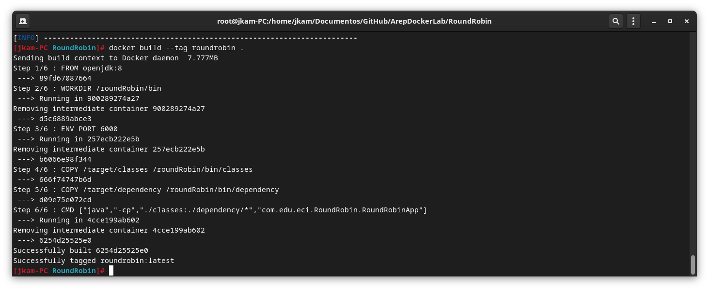
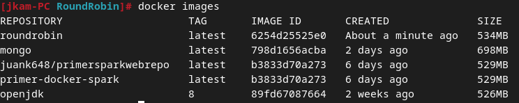

# TALLER DE DE MODULARIZACIÓN CON VIRTUALIZACIÓN E INTRODUCCIÓN A DOCKER Y A AWS

## Escuela Colombiana de Ingeniería - Enterprise Architectures(AREP).

_En este laboratorio se creo una simple web app usando Spark, ademas se encuentra desplegado en un contenedor usando la tecnologia de Docker

## Empezando

### Prerrequisitos

- [Maven](https://maven.apache.org/) - Dependency Management.

- [Java 8](https://www.oracle.com/co/java/technologies/javase/javase-jdk8-downloads.html) -  Development Environment.

- [Git](https://git-scm.com/) - Version Control System.

- [Spark](http://sparkjava.com/) - Micro framework for creating web applications in Java 8.

### Instalacion
1. Clone el repositorio:

```
git clone https://github.com/Juank648/ArepDockerLab
```

### LocalHost
Para usar Docker de manera local

1. Iniciamos la terminal desde el directorio raiz del repositorio
2. Accedemos al directorio de roundrobin

```
cd RoundRobin/ 
```
3. Ejecutamos el siguiente comando para crear la imagen en Docker

```
docker build --tag roundrobin .
```

4. Obtenemos lo siguiente



podemos observar que efectivamente se ha creado usando el comando
```
docker images
```



